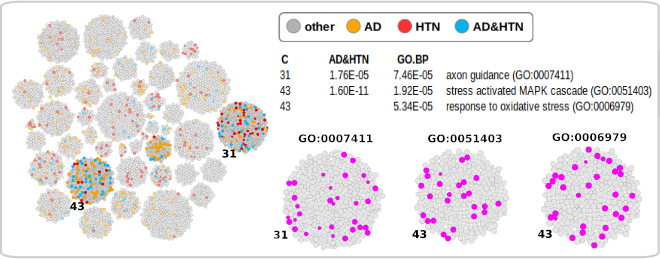

# rblock
Block Model c/c++ code wrapped in R

  
  <!--  -->

Code to run the traditional Stochastic Block Model (SBM) and Degree-Corrected Stochastic Block Model (DC-SBM) on a network, given either continuous or categorical 
meta-data associated with the network's nodes [1]. Model selected using the Minimum Description Length (MDL) approach [2] (to complete), and block selection using an MCMC approach [3] (to complete). 

[1] M.E.J. Newman & Aaron Clauset. "Structure and inference in annotated networks", Nature Communitications, 7:11863, (2016). doi:10.1038/ncomms11863 

[2] Tiago P. Peixoto. "Hierarchical Block Structures and High-Resolution Model Selection in Large Networks", Physical Review X, 4, 011047 (2014). doi:10.1103/PhysRevX.4.011047

[3] Maria A. Riolo, George T. Cantwell, Gesine Reinert, and M. E. J. Newman. "Efficient method for estimating the number of communities in a network", Phys. Rev. E 96, 032310. doi:10.1103/PhysRevE.96.032310

The code should be viewed as work in progress. A starting point, to be extended, customised and applied to biomedical networks with a focus on patient networks with assocaited meta-data.
The code is build apon the work of Prof. M.E.J. Newman and associates. 

Extensions:

1) Likely patient networks will involved a similarity score, weighting, between patients.  

Read: C. Aicher, A. Z. Jacobs and A. Clauset. "Learning Latent Block Structure in Weighted Networks", arXiv:1404.0431v2 (2014).

2) Directed networks.

Read: Wendt, Jeremy D, Quach, Tu-Thach, Zage, David John, Field, Richard V.,, Wells, Randall, Soundarajan, Sucheta, and Cruz, Gerardo. Data Inferencing on Semantic Graphs (DISeG) Final Report.. United States: N. p., 2016. Web. doi:10.2172/1562648. 

3) Regularised SBMs:

Read: Lu, X., Szymanski, B.K. A Regularized Stochastic Block Model for the robust community detection in complex networks. Sci Rep 9, 13247 (2019). https://doi.org/10.1038/s41598-019-49580-5

References:

[4] Aurelien Decelle, Florent Krzakala, Cristopher Moore, and Lenka Zdeborova. "Inference and Phase Transitions in the Detection of Modules in Sparse Networks", PRL, 107, 065701 (2011). doi:10.1103/PhysRevLett.107.065701

[5] Pan Zhang and Cristopher Moore. "Scalable detection of statistically significantcommunities and hierarchies, using messagepassing for modularity", PNAS, 111, 51, 18144–18149 (2014). doi:10.1073/pnas.1409770111
